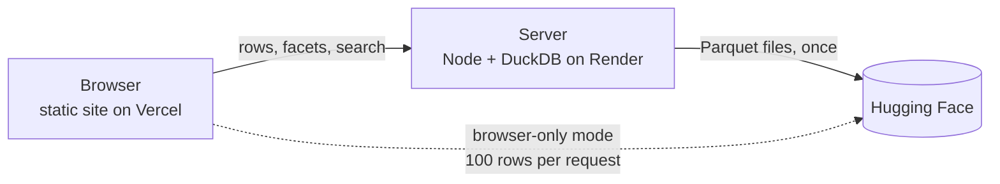

# Dataset Explorer

A fast explorer for Hugging Face datasets, built for LLM chat and tool-calling data. Open any dataset by name, move
through it with the keyboard, filter with live facet counts, search with text or regex, and read each row the way it
was meant to be read: as a conversation, with tool definitions and tool calls laid out properly.

It started as a replacement for the Hugging Face Data Studio, which is slow and crashes on large chat and
tool-calling datasets.


## Features

- **Open any dataset**: paste `owner/name` or a huggingface.co link. Gated and private datasets work through
  "Sign in with Hugging Face" or a pasted token.
- **Rows rendered by shape**: chat bubbles, tool-call cards with their arguments, collapsible tool definitions with
  parameter tables, `<think>` blocks, tool results. Anything else falls back to a field view with raw JSON.
- **Facets with live counts**: derived for tool-calling data (tools offered, calls made, reply kind, query words
  found in a tool, single vs multi-turn) and generated from the remaining columns (categories, numeric ranges,
  list lengths). Multi-select, and each count ignores its own selection.
- **Search**: plain text or `/regex/`, with highlighting in the list and the row.
- **Fast navigation**: `j`/`k` next and previous, `r` random row, `/` to search, paging, light and dark themes.
- **Huge datasets**: with the optional backend, the whole dataset is indexed once and every search, filter and
  facet runs over all rows in milliseconds.

| Landing page | Dark mode |
| --- | --- |
|  |  |

## Supported formats

The explorer reads the schema and a sample of rows, then decides which column plays which role:

| Role | Recognised as |
| --- | --- |
| Conversation | OpenAI `messages`, ShareGPT `conversations` (`from`/`value`), BFCL nested `question`, `USER:`/`ASSISTANT:` transcripts, or a plain `query` string |
| Tool definitions | OpenAI `{type: "function", function: {...}}`, flat `{name, description, parameters}`, xLAM style parameters, JSON strings of either |
| Tool calls | `answers`, `tool_calls`, inline `<TOOLCALL>`, `<tool_call>` and glaive `<functioncall>` |
| Responses | `chosen_response`, `rejected_response`, `response`, `output`, `completion` and similar |

Tested on When2Call, xLAM, ToolACE, Hermes function calling and Glaive function calling.

## How it works



- **Browser-only mode** (no backend): the page calls the Hugging Face datasets API directly, loads rows in pages of
  100 and keeps them in memory. Facets and search cover the rows loaded so far. Nothing needs hosting except the
  static files.
- **Server mode**: the backend downloads a dataset's Parquet files once, loads them into DuckDB and indexes every
  row. The browser then holds only the current page. If the server is unreachable or a dataset is too large, the
  page falls back to browser-only mode on its own.

The schema detection, row normalizer and facet logic live in `prototype/js/schema.js` and are shared by the browser
and the server, so both behave the same.

## Quick start

```bash
# Frontend (static files, no build step)
python3 -m http.server 8765 -d prototype        # http://localhost:8765

# Backend (optional)
cd server && npm install && npm start            # http://localhost:8787
```

To use the local backend, run this once in the browser console on the page:

```js
localStorage.setItem("dx.api", "http://localhost:8787")
```

Run the tests with `npm test` (Node 20 or newer).

## Configuration

Frontend settings are in `prototype/js/config.js`:

| Setting | Purpose |
| --- | --- |
| `API_URL` | URL of the backend. Empty means browser-only mode. |
| `HF_CLIENT_ID` | Client id of a public Hugging Face OAuth app, to enable "Sign in with Hugging Face". |
| `HF_SCOPES` | OAuth scopes, `openid profile gated-repos` by default. |

Backend settings are environment variables, all optional. See [`server/.env.example`](server/.env.example):
`DATA_DIR`, `ALLOWED_ORIGINS`, `MAX_DATASET_GB`, `CACHE_MAX_GB`, `INDEX_MAX_ROWS`, `PRIVATE_TTL_HOURS`,
`PUBLIC_IDLE_HOURS`, `DUCKDB_MEMORY`, `DUCKDB_THREADS`, `MAX_JOBS`.

### Hugging Face sign-in

Create a public OAuth app (no client secret) at <https://huggingface.co/settings/applications/new>, add the exact URL
the site is served from as a redirect URI (for local development, `http://localhost/` covers any port), and paste
its client id into `HF_CLIENT_ID`. Access to a gated dataset still has to be approved for your account on its
Hugging Face page.

## Deployment

The frontend is static and deploys to Vercel with the project root set to `prototype`. The backend deploys to
Render from the `Dockerfile` in the repository root, described by [`render.yaml`](render.yaml): in Render choose
New, then Blueprint, and pick this repository.

Pushes to `main` run CI on GitHub Actions, and Vercel and Render deploy from the same repository.

On Render's free plan the backend sleeps after 15 minutes without traffic and its disk is ephemeral. The page wakes
it on load (up to a minute), and datasets are downloaded again after a sleep. Raise the plan and add a disk to keep
them cached across restarts, and raise `MAX_DATASET_GB`, `CACHE_MAX_GB` and `DUCKDB_MEMORY` with it.

## Privacy

- Browser-only mode sends nothing to any server except Hugging Face. Tokens stay in the browser.
- In server mode the token is forwarded to the backend so it can download gated Parquet files. It is used for the
  download only and is never stored.
- Data that needed a token is cached per token, readable only with that token, and deleted when the token expires,
  when you sign out, or after `PRIVATE_TTL_HOURS` for pasted tokens. Data readable without a token is cached once
  and shared.
- Hugging Face dataset licenses still apply. This project does not redistribute dataset contents.

## Project layout

```
prototype/        static frontend (index.html, css/, js/)
  js/schema.js    schema detection, row normalizer, facets (shared with the server)
  js/hf.js        Hugging Face datasets API client for browser-only mode
  js/remote.js    client for the backend
  js/auth.js      Sign in with Hugging Face (OAuth, PKCE)
server/           Node backend (Hono + DuckDB)
test/             unit tests for the shared logic
docs/             screenshots
```

`prototype/build_data.py` can also write a few datasets as local JSONL samples into `prototype/data/`, which the
landing page then lists.

## Limitations

- Only datasets that the Hugging Face viewer can convert to Parquet open in server mode.
- The server indexes the first 2,000,000 rows of a split (`INDEX_MAX_ROWS`), and splits larger than
  `MAX_DATASET_GB` open in browser-only mode instead.
- The reply kind and query-overlap facets are simple heuristics.
- Opening a very large dataset for the first time takes a while, because it is downloaded and indexed once.

## License

[MIT](LICENSE)
