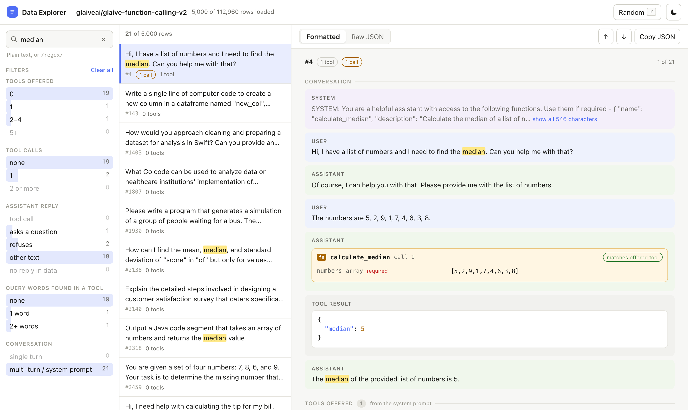
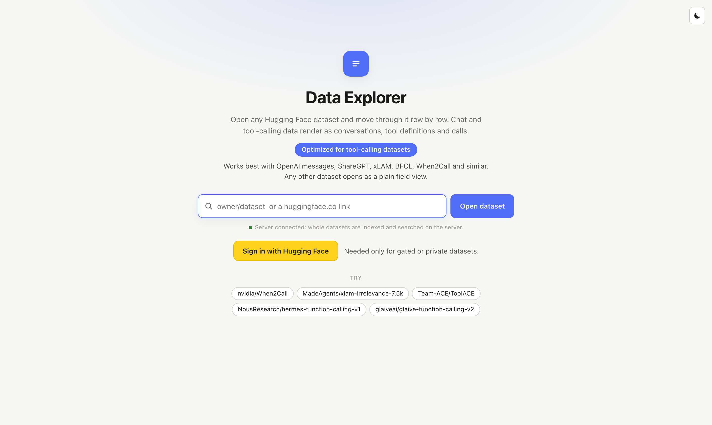
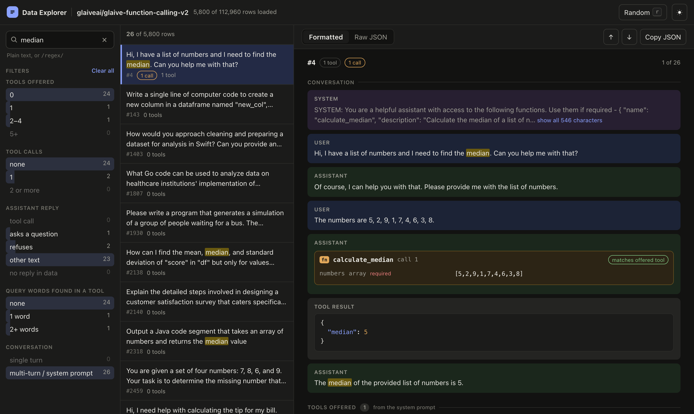

# Dataset Explorer

**A fast way to read Hugging Face datasets, built for chat and tool-calling data.**

Open any dataset by name and read it the way it was meant to be read: conversations as chat bubbles, tool calls as
cards with their arguments, tool definitions with their parameters. No waiting, no crashes on big datasets.

### [Open Dataset Explorer](https://hf-dataset-explorer.vercel.app)

## What you can do

- **Open any Hugging Face dataset.** Type `owner/name` or paste a link. Try `nvidia/When2Call`,
  `Team-ACE/ToolACE` or `NousResearch/hermes-function-calling-v1`.
- **Read rows properly.** Chat messages, tool calls, tool results, `<think>` blocks, Markdown, code and JSON are all
  formatted. Long messages collapse, with a button to show everything.
- **Check tool calls against their schema.** Each call shows whether the tool was offered, and each argument shows
  its type and whether it is required. Unknown and missing arguments are flagged.
- **Filter with live counts.** Filters for tools offered, calls made, reply type and more, plus filters built from
  the dataset's own columns. Pick several values, and the counts update as you go.
- **Search everything.** Plain text or regular expressions such as `/what is the \w+ forecast/`, with matches
  highlighted.
- **Move fast.** `j` and `k` for next and previous row, `r` for a random row, `/` to search.
- **Raw JSON and copy.** Switch to the raw row any time, or copy it.
- **Light and dark theme.**

| Start page | Dark theme |
| --- | --- |
|  |  |

## Gated and private datasets

Click **Sign in with Hugging Face** on the start page, then open the dataset. You still need to have been granted
access to the dataset on Hugging Face itself.

## Which datasets look best

Anything on Hugging Face opens. Chat and tool-calling datasets get the full treatment:

- OpenAI-style `messages` and ShareGPT `conversations`
- Tool definitions in OpenAI, xLAM, BFCL and Hermes styles, including ones written into the system prompt
- Tool calls in `tool_calls`, `answers`, `<tool_call>`, `<TOOLCALL>` and Glaive `<functioncall>` form
- Preference data with chosen and rejected responses

Other datasets open as a plain list of fields.

## Good to know

- Small and medium datasets are indexed on a server, so search and filters cover every row. Very large datasets load
  in your browser instead, a few thousand rows at a time in the background, and search covers what has loaded.
- The server runs on free hosting, so the first visit after a quiet period can take up to a minute to wake it up.

## Privacy

- Your Hugging Face sign-in is only used to read the datasets you ask for.
- Data that needed your sign-in is stored for you alone, and deleted when you sign out or your sign-in expires.
- Dataset contents are never republished. Hugging Face dataset licenses still apply.

## License

[MIT](LICENSE)
